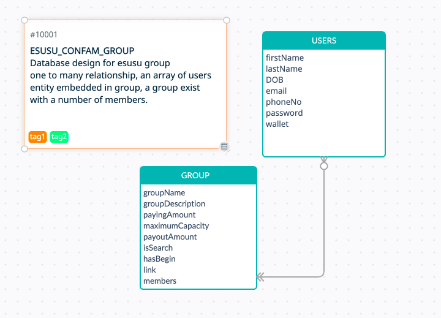

# ESUSU CONFAM LIMITED &middot; [](https://travis-ci.org/npm/npm) [](https://www.npmjs.com/package/npm) [](http://makeapullrequest.com) [](https://github.com/your/your-project/blob/master/LICENSE)
> Assessment for a backend developer role

Esusu Confam Ltd, a long-running Co-operative in Nigeria. Allows a group of users save a fixed amount automatically every week and then one of the members collects the money at the end of every month.

## Installing / Getting started

clone this repository and run the commands shown below 

```shell
 npm install
```

install all dependencies to run project successfully

```shell
 npm start
```

to start running the project

## Developing

### Built With
- nodejs
- express
- jwt

### Prerequisites
- a suitable IDE (vscode, webstorm)


### Setting up Dev

Here's a brief intro about what a developer must do in order to start developing
the project further:

```shell
git clone https://github.com/Kaydayo/ESUSU-CONFAM_LTD.git
cd ESUSU-CONFAM_LTD
npm install
```

--
### Deploying / Publishing
after commiting new changes to main branch, to deploy kindly do the following

```shell
 heroku login 
 heroku create -a <app name>  
 git push heroku main
```

heroku cli to deploy app to heroku


## Configuration

all environmental variables declared in app should be configured in deploy


## Api Reference

link to documentation below
[postman api documentation](https://documenter.getpostman.com/view/18656151/UyxjF6Sj)


## Database
Mongodb was setup fo this project 


## Licensing

State what the license is and how to find the text version of the license.